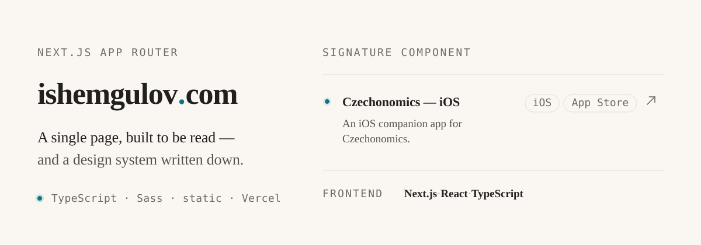

<p align="center">
  
</p>

Source of **[ishemgulov.com](https://ishemgulov.com)** — the personal site of Ruslan Ishemgulov,
software engineer.

## What it is

One page: a nav, a hero, and four sections — projects, skills, writing, contact — stacked in a
single 1020px column and separated by hairlines. No CMS, no database, no data fetching. Every word
on the page comes from one TypeScript file and is rendered by one page component.

## Why it looks like this

The design is not re-decided per commit. [`DESIGN.md`](DESIGN.md) is the normative source for the
tokens, the components, and the named rules that constrain them:

- **One column.** Content is never placed side by side. If two things compete for the same
  horizontal band, one of them is not important enough to be on the page.
- **One hue.** Signal Teal `#6fb3a6` is the only chromatic color — row markers, the wordmark
  period, hover borders. No second accent, no semantic palette, no warm neutral.
- **No box.** No cards, no panels, no shadows, no mid-range corner radius. A hairline above a row
  is the entire container vocabulary.
- **Contrast floor.** No text drops below 4.5:1 on the ground, including the faintest metadata.
  Quietness comes from size, weight, and tracking.
- **No motion.** Hover states only — no entrance animation, no scroll effects. Static is a
  decision, not an omission.

[`PRODUCT.md`](PRODUCT.md) holds the other half: who the site is for, and what it may never claim —
no invented metrics, no testimonials, no "hire me" call to action.

## Where things live

| Path | Contents |
| --- | --- |
| [`app/_home/homeData.ts`](app/_home/homeData.ts) | All content — projects, skills, writing, links |
| [`app/page.tsx`](app/page.tsx) | The whole page |
| [`app/globals.scss`](app/globals.scss) · [`styles/home.scss`](styles/home.scss) | Ground, rows, and the reorganization at 680px |
| [`app/icon.tsx`](app/icon.tsx) | Favicon and app icon, generated from the tokens through `next/og` |
| [`app/opengraph-image.tsx`](app/opengraph-image.tsx) | OG card — a restatement of the first viewport |

To change what the site says, edit `homeData.ts`. Section counts are derived from that data rather
than typed in.

## Getting started

```bash
yarn install
yarn dev       # http://localhost:3000
```

No environment variables, license tokens, or private registries required.

## Scripts

| Script | Purpose |
| --- | --- |
| `yarn dev` | Start the dev server |
| `yarn build` | Production build |
| `yarn start` | Serve the production build |
| `yarn lint` | ESLint |
| `yarn type-check` | `tsc --noEmit` |
| `yarn prettify` / `yarn prettier` | Write / check formatting |

## Stack

Next.js 15 (App Router) · React 18 · TypeScript (strict) · Sass ·
[Geist](https://vercel.com/font) Sans + Mono · [lucide-react](https://lucide.dev) ·
Vercel Analytics. Deployed on Vercel.
